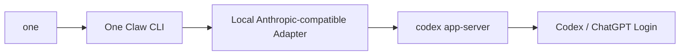

# One Claw

`One Claw` 是一个基于 Claude Code 源码快照重构并二次改造的终端 AI 编程助手。

当前这套仓库已经改成了：
- 前端命令名为 `one`
- 默认后端为 `Codex CLI + 本地 Anthropic-compatible adapter`
- 默认使用独立配置目录 `~/.one-claw`
- 与本机官方 `claude` 配置隔离

## 当前状态

- 入口命令：`one`
- 当前 CLI 版本：`1.0 (One Claw)`
- 当前默认 provider：`codex`
- 当前默认认证方式：通过 `Codex CLI` 登录，再由本地 adapter 提供 Anthropic 风格接口

## 运行架构



`one` 的启动器会先做两件事：
- 将配置目录固定到 `~/.one-claw`
- 检查本地 adapter 是否已启动；如果没有，会自动拉起 `stack:codex`

所以正常情况下你只需要执行一个命令：

```bash
one
```

## 环境要求

- Bun `1.3+`
- Codex CLI
- 已登录的 Codex / ChatGPT 账户

已验证版本：

```bash
bun --version
codex --version
one --version
```

## 安装

### 1. 安装依赖

```bash
cd /Users/mac/Documents/claude-code-source
bun install
```

### 2. 把 `one` 放进 PATH

仓库已经提供了启动器：

- [bin/one](/Users/mac/Documents/claude-code-source/bin/one)

如果你本机还没把它链接到 PATH，可以执行：

```bash
mkdir -p ~/.local/bin
ln -sf /Users/mac/Documents/claude-code-source/bin/one ~/.local/bin/one
```

然后确保 `~/.local/bin` 在 PATH 里。

## 登录

### 登录

```bash
one auth login
```

### 查看状态

```bash
one auth status
```

当前实现会优先从本地 Codex 登录态读取账户信息，并补充查询订阅状态。典型输出类似：

```json
{
  "loggedIn": true,
  "authMethod": "chatgpt",
  "apiProvider": "codex",
  "email": "your-account@example.com",
  "subscriptionType": "plus"
}
```

### 登出

```bash
one auth logout
```

## 使用

### 交互模式

```bash
one
```

### 非交互模式

```bash
one -p "帮我总结这个仓库"
```

### 流式 JSON 输出

```bash
one -p "帮我总结这个仓库" --output-format stream-json
```

### 查看版本

```bash
one --version
```

## 手动启动后端

虽然 `one` 默认会自动拉起后端栈，但调试时你也可以手动分开启动。

### 启动 Codex 后端栈

```bash
cd /Users/mac/Documents/claude-code-source
bun run stack:codex
```

### 单独启动 CLI

```bash
cd /Users/mac/Documents/claude-code-source
bun run start:codex
```

### 单独启动 adapter

```bash
cd /Users/mac/Documents/claude-code-source
bun run adapter:codex
```

## 常用脚本

见 [package.json](/Users/mac/Documents/claude-code-source/package.json)：

- `bun run start`
- `bun run start:codex`
- `bun run stack:codex`
- `bun run adapter:codex`
- `bun run build`
- `bun run typecheck`

## 配置隔离

`one` 默认使用：

```bash
~/.one-claw
```

不会再与官方 `claude` 共用：

```bash
~/.claude
```

首次运行时，启动器会把旧的 Claude 配置迁移一份到 `~/.one-claw`，之后两边互不影响。

## 项目结构

核心目录：

- [bin](/Users/mac/Documents/claude-code-source/bin)
- [runtime](/Users/mac/Documents/claude-code-source/runtime)
- [entrypoints](/Users/mac/Documents/claude-code-source/entrypoints)
- [cli](/Users/mac/Documents/claude-code-source/cli)
- [components](/Users/mac/Documents/claude-code-source/components)
- [commands](/Users/mac/Documents/claude-code-source/commands)
- [services/codex](/Users/mac/Documents/claude-code-source/services/codex)
- [packages/codex-anthropic-adapter](/Users/mac/Documents/claude-code-source/packages/codex-anthropic-adapter)
- [tools](/Users/mac/Documents/claude-code-source/tools)
- [utils](/Users/mac/Documents/claude-code-source/utils)

## 当前改造点

这份仓库相对原始源码快照，已经做了这些关键改造：

- 品牌与命令改为 `One Claw` / `one`
- 认证与模型后端切到 `Codex CLI`
- 增加本地 Anthropic-compatible adapter
- 增加 `one` 单命令自动启动体验
- 增加独立配置目录 `~/.one-claw`
- 首页信息改为读取真实 Codex 账号和订阅状态
- 支持交互模式、`-p` 非交互模式和流式输出

## 已知限制

- adapter 的部分会话映射仍是进程内状态，重启后端后不会继承之前的内存态
- Claude.ai 专属控制面能力没有完整迁移到 Codex 模式
- 本仓库仍保留较多历史目录结构，仓库名也尚未改成 `one-claw`

## 开发与验证

### 构建

```bash
cd /Users/mac/Documents/claude-code-source
bun run build
```

### 打包 release

```bash
cd /Users/mac/Documents/claude-code-source
bun run package:release
```

默认会生成：

- `release/one-claw-v1.0-macos-universal.tar.gz`
- `release/one-claw-v1.0-macos-universal.zip`

解压后直接运行：

```bash
./bin/one
```

### 类型检查

```bash
cd /Users/mac/Documents/claude-code-source
bun run typecheck
```

### 最小验证

```bash
one --version
one auth status
one -p "Reply with exactly OK and nothing else."
```

## 说明

这个仓库来源于 Claude Code 相关源码快照的重构与整理版本，当前仓库内容已经不再是“原样镜像”，而是一个可运行、可二次开发的本地化改造版本。
